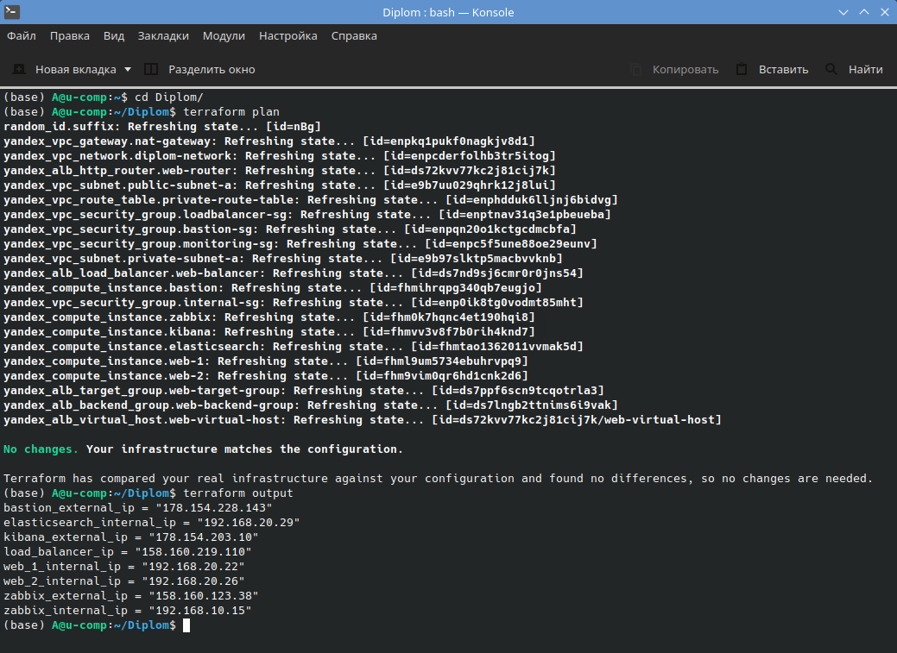
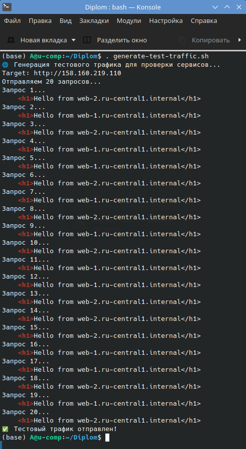
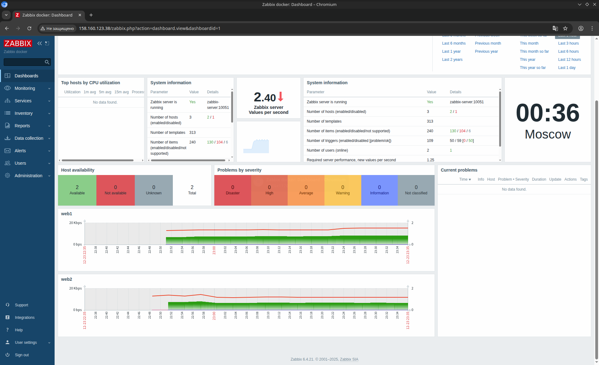
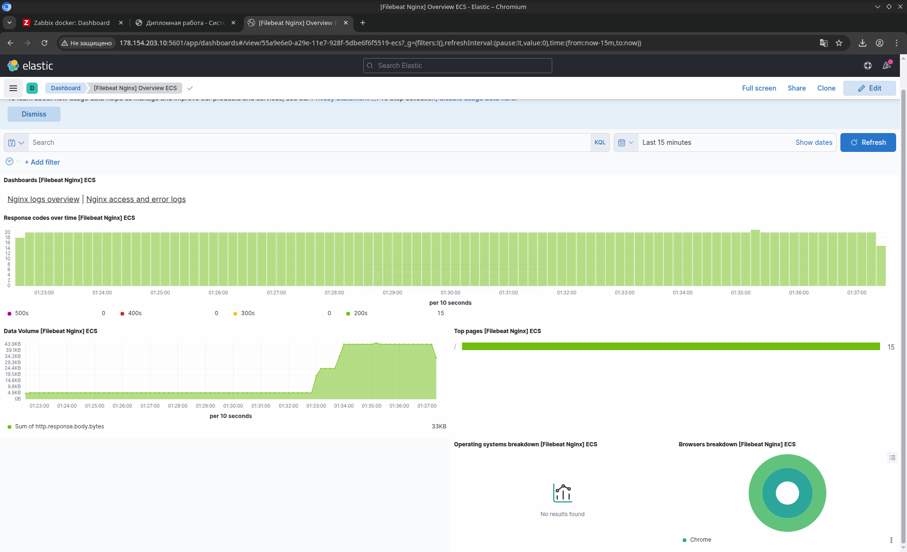
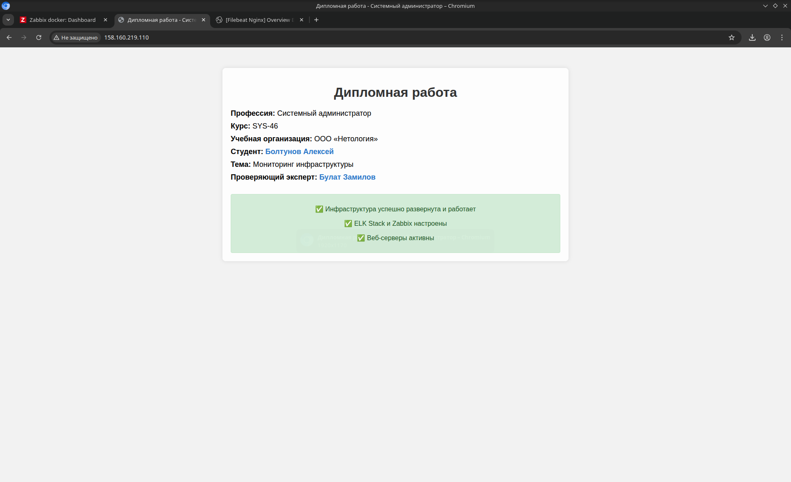

# 🎓 Дипломная работа: Мониторинг инфраструктуры

## 📖 Описание проекта

Этот проект представляет собой **полностью автоматизированное развертывание инфраструктуры с системами мониторинга и логирования** в облаке Yandex Cloud. Целью является создание отказоустойчивой, масштабируемой и безопасной системы, позволяющей отслеживать состояние веб-приложений и инфраструктурных компонентов в реальном времени.

## 🎯 Цели и задачи

*   **Развертывание инфраструктуры**: Создать виртуальные машины, сети, балансировщик нагрузки и правила безопасности с помощью Terraform.
*   **Установка и настройка ELK Stack**: Настроить сбор, хранение и визуализацию логов с веб-серверов с помощью Elasticsearch, Logstash (через Filebeat), и Kibana.
*   **Установка и настройка Zabbix**: Настроить централизованный мониторинг метрик (CPU, память, диск, сеть) с использованием Zabbix Server и агентов.
*   **Обеспечение безопасности**: Настроить изолированные подсети, NAT, и корректные правила групп безопасности.
*   **Автоматизация**: Использовать Ansible для установки и настройки всех сервисов, обеспечивая воспроизводимость и масштабируемость.

## 🏗️ Архитектура

*   **Bastion Host**: Единственная точка входа извне для управления приватной инфраструктурой.
*   **Публичная подсеть** (`192.168.10.0/24`): Содержит Bastion, Zabbix Server, Kibana.
*   **Приватная подсеть** (`192.168.20.0/24`): Содержит веб-серверы (Nginx), Elasticsearch, Filebeat.
*   **Load Balancer**: Распределяет трафик между веб-серверами.
*   **NAT Gateway**: Обеспечивает исходящий интернет-трафик из приватной подсети.
*   **ELK Stack**:
    *   **Elasticsearch**: Хранение и индексация логов.
    *   **Kibana**: Веб-интерфейс для визуализации логов.
    *   **Filebeat**: Агент на веб-серверах для отправки логов Nginx в Elasticsearch.
*   **Zabbix**:
    *   **Zabbix Server**: Центральный компонент мониторинга, запущенный в Docker.
    *   **Zabbix Web**: Веб-интерфейс Zabbix.
    *   **Zabbix Agent**: Установлен на веб-серверах для сбора метрик и отправки в Zabbix Server.
    *   **PostgreSQL**: База данных для Zabbix.

## 🛠️ Стек технологий

*   **Yandex Cloud**: Облачный провайдер.
*   **Terraform**: Управление инфраструктурой как код (IaC).
*   **Ansible**: Управление конфигурацией и развертывание.
*   **Docker / Docker Compose**: Контейнеризация Zabbix.
*   **ELK Stack** (Elasticsearch, Kibana, Filebeat): Логирование и визуализация.
*   **Zabbix**: Система мониторинга.
*   **Nginx**: Веб-сервер.
*   **Ubuntu 22.04 LTS**: Операционные системы виртуальных машин.

## 🚀 Быстрый старт

### Требования

*   Установленный `terraform`.
*   Установленный `ansible`.
*   Установленный `jq` (для некоторых команд).
*   Аккаунт в Yandex Cloud и CLI `yc` настроен с активным облаком и каталогом.
*   Сгенерированный SSH-ключ `~/.ssh/yc-ed25519`.

### 1. Развертывание инфраструктуры

1.  Убедитесь, что переменные в `variables.tf` (каталог, облако, зона) соответствуют вашему окружению.
2.  Инициализируйте Terraform:
    ```bash
    terraform init
    ```
3.  Проверьте план развертывания:
    ```bash
    terraform plan
    ```
4.  Примените конфигурацию:
    ```bash
    terraform apply -auto-approve
    ```
5.  Дождитесь завершения создания всех ресурсов.

### 2. Настройка с помощью Ansible

1.  Убедитесь, что файл `inventory.yml` соответствует выводу `terraform output`. При необходимости сгенерируйте его автоматически:
    ```bash
    # Пример генерации inventory.yml (может потребоваться ручная настройка)
    echo "[all]" > inventory.yml
    echo "bastion ansible_host=$(terraform output -raw bastion_external_ip) ansible_user=ubuntu ansible_ssh_private_key_file=~/.ssh/yc-ed25519" >> inventory.yml
    echo "zabbix ansible_host=$(terraform output -raw zabbix_internal_ip) ansible_host_public=$(terraform output -raw zabbix_external_ip) ansible_user=ubuntu ansible_ssh_private_key_file=~/.ssh/yc-ed25519 ansible_ssh_common_args='-o ProxyCommand=\"ssh -W %h:%p -q ubuntu@$(terraform output -raw bastion_external_ip)\"'" >> inventory.yml
    # Аналогично для web-1, web-2, elasticsearch, kibana
    # Или используйте динамический инвентарь Ansible для YC
    ```
2.  Скопируйте файлы в директорию `~/Diplom/ansible` на Bastion Host.
3.  Подключитесь к Bastion Host:
    ```bash
    ssh -i ~/.ssh/yc-ed25519 ubuntu@$(terraform output -raw bastion_external_ip)
    ```
4.  Запустите плейбуки на Bastion:
    *   Установка ELK Stack:
        ```bash
        ansible-playbook -i inventory.yml elk-stack.yml
        ```
    *   Установка Zabbix Server:
        ```bash
        ansible-playbook -i inventory.yml zabbix-setup.yml
        ```
    *   Установка Zabbix Agent:
        ```bash
        ansible-playbook -i inventory.yml zabbix-agents.yml
        ```

### 3. Доступ к сервисам

*   **Веб-сайт**: Доступен через внешний IP Load Balancer: `http://$(terraform output -raw load_balancer_ip)`
*   **Kibana**: Доступна через SSH-туннель с локальной машины:
    ```bash
    ssh -i ~/.ssh/yc-ed25519 -L 5601:kibana.ru-central1.internal:5601 ubuntu@$(terraform output -raw bastion_external_ip)
    ```
    Затем откройте `http://localhost:5601` в браузере.
*   **Zabbix Web UI**: Доступен через SSH-туннель с локальной машины:
    ```bash
    ssh -i ~/.ssh/yc-ed25519 -L 8080:zabbix.ru-central1.internal:80 ubuntu@$(terraform output -raw bastion_external_ip)
    ```
    Затем откройте `http://localhost:8080` в браузере. Пройдите первоначальную настройку, если это первый запуск.
*   **Bastion Host**: `ssh -i ~/.ssh/yc-ed25519 ubuntu@$(terraform output -raw bastion_external_ip)`
*   **Приватные хосты (web-1, web-2, elasticsearch, kibana, zabbix)**: Подключение только через Bastion:
    ```bash
    ssh -i ~/.ssh/yc-ed25519 -o ProxyCommand="ssh -W %h:%p -q ubuntu@$(terraform output -raw bastion_external_ip)" ubuntu@<internal_ip>
    # Или используя имена хостов, если они разрешаются (например, web-1.ru-central1.internal)
    ssh -i ~/.ssh/yc-ed25519 -o ProxyCommand="ssh -W %h:%p -q ubuntu@$(terraform output -raw bastion_external_ip)" ubuntu@web-1.ru-central1.internal
    ```

## 📊 Мониторинг и логирование

*   **Zabbix**: Добавьте хосты `web-1.ru-central1.internal` и `web-2.ru-central1.internal` в Zabbix UI для мониторинга метрик.
*   **Kibana**: Создайте индекс-паттерн `filebeat-*` и используйте дашборды для анализа логов Nginx.

## 💾 Резервное копирование

*   **PostgreSQL (Zabbix)**: Рекомендуется настроить регулярные бэкапы базы данных PostgreSQL, возможно, с использованием `pg_dump` и хранением в Object Storage YC.
*   **Elasticsearch**: Рекомендуется настроить Snapshot Repository (например, в Object Storage YC) и регулярные снапшоты индексов.
*   **Конфигурации**: Исходный код Terraform и Ansible должен храниться в системе контроля версий (например, Git).

## 🧪 Тестирование (скриншоты)

### Проверка развернутого терраформ


### Проверка loadbalancer


### Проверка Zabbix


### Проверка ELK


### Проверка сайта


### Ссылки для проверки

* Сайт


* Zabbix


* ELK
[ELK](http://178.154.203.10:5601/app/dashboards#/view/55a9e6e0-a29e-11e7-928f-5dbe6f6f5519-ecs?_g=(filters:!(),refreshInterval:(pause:!t,value:0),time:(from:now-15m,to:now)))
## 🗑️ Удаление инфраструктуры

Для полного удаления всех созданных ресурсов выполните:
```bash
terraform destroy -auto-approve
